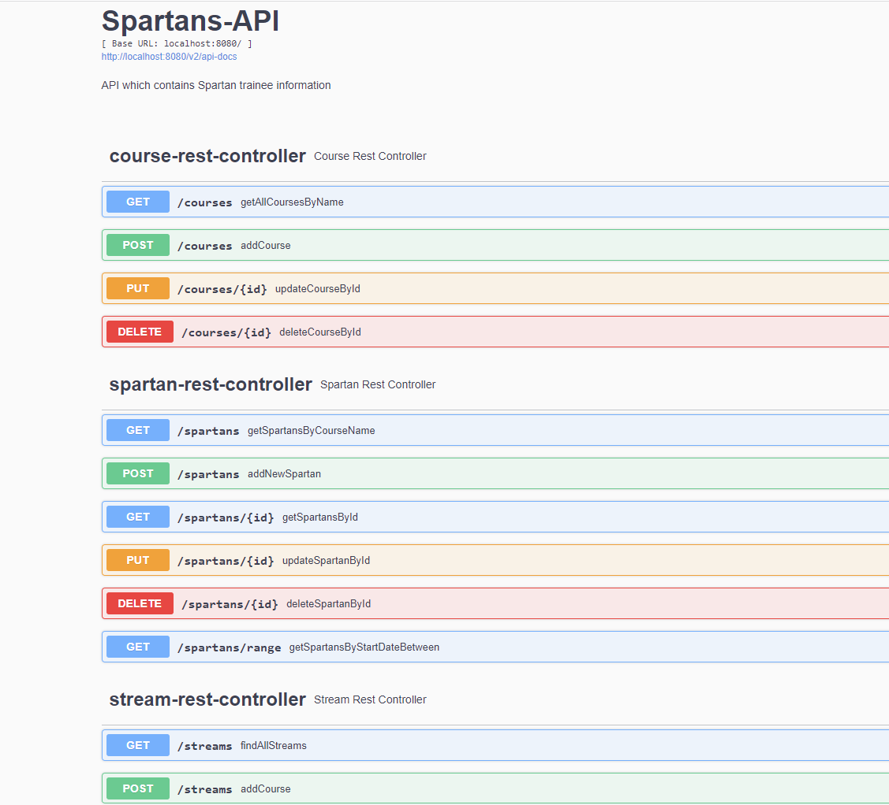

# Spartan REST API

This is a RESTful API built using the Spring Boot framework for Java. This API implements the MVP requirement produced by the Product Owner. The testing framework for this project can be accessed at this [link](https://github.com/GMitchell97/SpartansAPI-SDET).

#Table of Contents
1. [Setup Guide](#1-setup-guide)
2. [Server setup](#2-run-the-server)
3. [Swagger Documentation](#3-swagger-documentation)
4. [Testing in Postman](#4-testing-in-postman)
5. [MongoDB](#5-mongodb)
6. [Acknowledgements](#6-acknowledgements)
## Features

- [x]  Cloud hosted MongoDB Database
- [x]  Use of Functional Programming
- [x]  Testing Framework made
- [x]  Docker
- [x]  Multiple endpoints and granular filtering

- [x]  Spring MVC Design Pattern
- [x]  Maven dependency management
- [x]  Mongo Atlas
- [x]  SOLID Principles applied where possible
- [x]  Swagger and Postman API documentation
- [x]  Testing in Postman

## 1. Setup Guide <a name="1-setup-guide"></a>

In order to run the API you need to run the `pom.xml` file so Maven can fetch the required dependencies.

Also there needs to be an [`application.properties`](http://application.properties) file created in the *resource* folder. The file should contain the following with the URL and login credentials adjusted to reflect your database.

```java
spring.data.mongodb.uri=mongodb:<INSERT-MONGODB-URL-HERE>
spring.data.mongodb.database=<DB-NAME>
```

Also a static folder needs to be created in the in the *resource* folder with an `index.html` file within that looks like the example below. This file is used to test API server, it can be replace with a static website if you wish. The file name must be the same.

```html
<!DOCTYPE html>
<html lang="en">
<head>
    <meta charset="UTF-8">
    <title>Title</title>
</head>
<body>
    <h1>Hello World</h1>
</body>
</html>
```

## 2. Run the Server   <a name="2-run-the-server"></a>

The REST API can be run by running the main method of the `SpartansApiApplication` class

```java
@SpringBootApplication
public class SpartansApiApplication {

    public static void main(String[] args) {
        SpringApplication.run(SpartansApiApplication.class, args);
    }
}
```

## 3. Swagger Documentation    <a name="3-swagger-documentation"></a> 

The swagger documentation for this API can be accessed from the following url: [http://localhost:8080/swagger-ui/index.html#/](http://localhost:8080/swagger-ui/index.html#/)



## 4. Testing in Postman    <a name="4-testing-in-postman"></a>

Postman was the goto tool of choice for debugging the API. Postman makes it easy to test endpoints and build documentation and run tests. While developing this API over 70 request were made and validated in Postman to aid with debugging.

Postman can also be used to [generate code](https://learning.postman.com/docs/sending-requests/generate-code-snippets/) in a variety of programming languages for easier API integration.


## 5. MongoDB <a name="5-mongodb"></a>

MongoDB is a NoSQL database program that uses JSON-like documents with optional schemas with faster query processing than SQL processing.


The Mongo database is seeded every time the database is run using the `MongoSeeder` class which is run by the `DatabaseSeederRunner`

## 6. Acknowledgements <a name="6-acknowledgements"></a>

- We would like to take moment to thank my trainers Manish, Neil, Nish and Cathy for the help and support in putting this project together.
- We would like to thank the C# group for helping us with this project.
- We would like to thank Richard for participating in this project as the Product Owner.